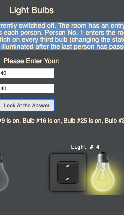

There are light bulbs lined up in a row in a long room. Each bulb has its own switch and is currently switched off. 

The room has an entry door and an exit door. There are people lined up outside the entry door. Each bulb is numbered consecutively from 1 to the amount of the bulb that you choose. So is each person. Person No. 1 enters the room, switches on every bulb, and exits. Person No. 2 enters and flips the switch on every second bulb (turning off bulbs 2, 4, 6, ...). Person No. 3 enters and flips the switch on every third bulb (changing the state on bulbs 3, 6, 9, ...). This continues until all people have passed through the room. How many of the light bulbs are illuminated after the last person has passed through the room?

Please try it:
https://lightbulbproject.herokuapp.com/

Coding Languages used:
 

